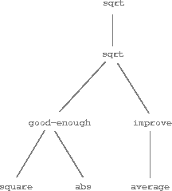

### Procedures as Black-Box Abstractions

``sqrt/1`` is our first example of a process defined by a set of mutually defined procedures. Notice that the definition of ``sqrt/2`` is recursive; that is, the procedure is defined in terms of itself. The idea of being able to define a procedure in terms of itself may be disturbing; it may seem unclear how such a "circular" definition could make sense at all, much less specify a well-defined process to be carried out by a computer. This will be addressed more carefully in section 9.3. But first let's consider some other important points illustrated by the ``sqrt`` example.

Observe that the problem of computing square roots breaks up naturally into a number of subproblems: how to tell whether a guess is good enough, how to improve a guess, and so on. Each of these tasks is accomplished by a separate procedure. The entire ``sqrt`` program can be viewed as a cluster of procedures (shown in figure 9.3) that mirrors the decomposition of the problem into subproblems.

