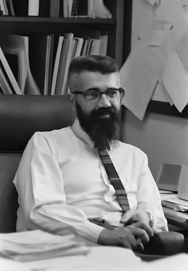

### John McCarthy

**Figure P.4**: John McCarthy, 1965.

John McCarthy was born in 1927, in the city of Boston. Due to difficulties finding work during the Great Depression, the family moved to New York, then finally settled in Los Angeles. Having establised an early aptitude and proficieny in mathematics, McCarthy skipped two years of math upon his enrollment at Caltech. The year he received his undergraduate degree, he attended the 1948 Hixon Symposium on Cerebral Mechanisms in Behavior. The speakers at the symposium represented an intersection of mathematics, computation, and psychology. They were as follows:

* Professor Ward C. Halstead, University of Chicago
* Professor Heinrich Kluver, University of Chicago
* Professor Wolfgang Kohler , Swarthmore College
* Professor K. S. Lashley, Harvard University
* Dr. R. Lorente de No, Rockefeller Institute for Medical Research
* Professor Warren S. Mc Culloch, University of Illinois
* Dr. John von Neumann, Institute for Advanced Study

John von Neumann presented his paper "The General and Logical Theory of Automata",[^1] after which McCarthy became intrigued with the idea of developing machines that could think as people do. McCarthy remained at Caltech for one year of grad school, and then pursed his PhD at Princeton. In discussions with an enthusiastic von Neumann at Princeton, McCarthy shared his ideas about interacting finite automata -- ideas inspired by von Neumann's talk at the Hixon Symposium.

After completing his PhD dissertation, Claude Shannon invited McCarthy and his friend Marvin Minksy to work with him at Bell Labs for the summer. McCarthy and Shannon collaborated on assembling a volume of papers entitled "Automata Studies". McCarthy was dissappointed that so few submissions concerned the topic of machine intelligence. A few years later, he had the opportunity to address this by proposing a summer research project which he and the head of IBM's Information Research pitched to Shannon and Minksy. They agreed, and a year later the now-famous Artificial Intelligence workshop was held in Dartmouth.

It was here, thanks to Allen Newell and Herb Simon, that McCarthy was exposed to the idea of list processing in for a proposed "logical language" (later named IPL). Upon seeing the implementation later, McCarthy was not particularly enthusiastic, due to its assembly-like style. That, in conjuntion with his inability to gain any traction with the maintainers of FORTRAN for the support of recursion or conditionals, inspired him to create a language that suited his goals of exploring machine intelligence. With the seeds of Lisp sown in 1956, it was two more years before development of Lisp began. Two years later a special project was established to carry out this work under the auspices of the MIT Research Laboratory of Electronics which granty McCarthy and his team one room, one secretary, two programmers, a key punch and six grad students.[^2] The MIT AI project was founded and Lisp was shortly thereafter born.

----

[^1]: A transcript of the talk is vailable in Volume V of John von Neumann "Collected Works". The topics covered were as follows: **1.** Preliminary Considerations; **2.** Discussion of Certain Relevant Traits of Computing Machines; **3.** Comparisons Between Computing Machines And Living Organisms; **4.** The Future Logical Theory of Automata; **5.** Principles of Digitalization; **6.** Formal Neural Networks; and **7.** The Concept of Complication and Self-Reproduction. The talk concluded with an intensive period of question and answer, also recorded in the above-mentioned volume.

[^2]: Marvin Minsky and John McCarthy founded the MIT AI Lab together when McCarthy caught the acting head of the department, Jerome Weisner, in the hallway and asked him permission to do it. Weisner responded with "Well, what do you need?”. When McCarthy gave him the list, he asked "How about 6 graduate students?" as the deparment had agreed to support six mathematics students, but had yet to find work for them. See [On John McCarthy’s 80th Birthday, in Honor of his Contributions](http://www-formal.stanford.edu/leora/hayes_morgenstern_birthday_mccarthy.pdf), page 3.

